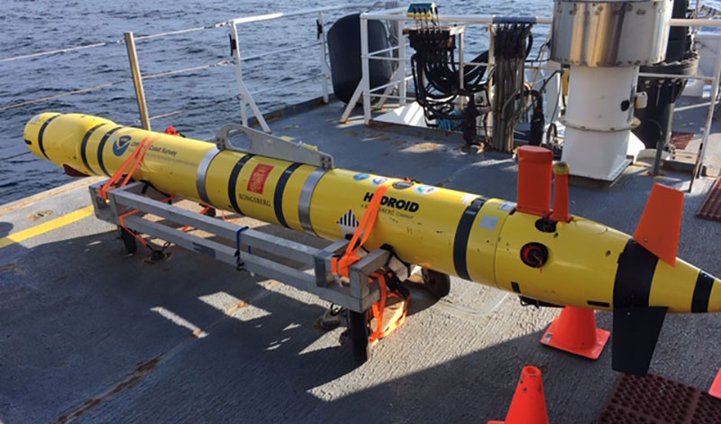
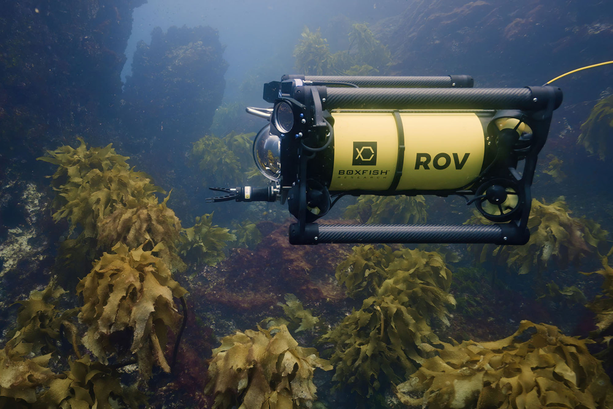
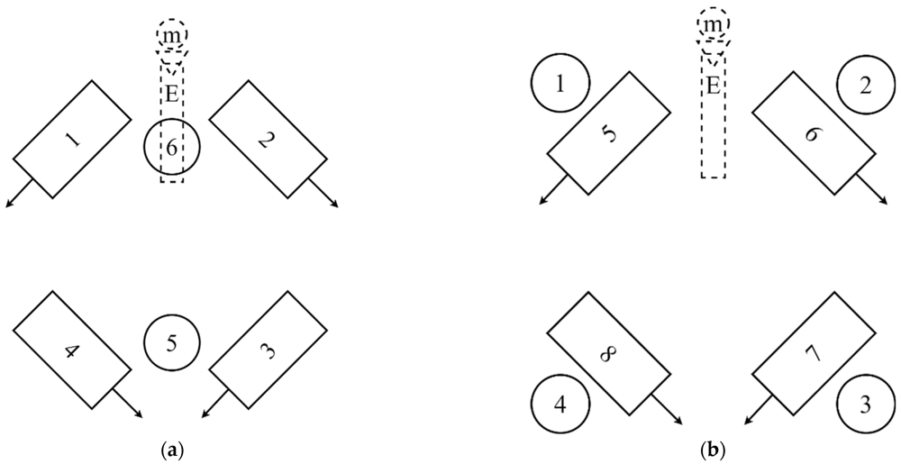

# Underwater Robotics: Shape Design & Locomotion

## Overview

**Autonomous Underwater Vehicles (AUVs)** are untethered, self-guided underwater robots carrying sensors and samplers for pre-programmed missions. For example, a *REMUS* AUV has a torpedo shape to minimize drag. AUVs store data onboard and operate independently, traveling kilometers at speeds of 1–2 m/s for hours or days.

  
*Figure: The torpedo-shaped REMUS AUV. AUVs like this carry sonar, cameras, and operate untethered.*

**Remotely Operated Vehicles (ROVs)** are tethered underwater robots controlled in real-time from a surface ship. A cable transmits power and commands, making ROVs ideal for inspection tasks. They often have manipulators for sampling or servicing, and 4–8 vectored thrusters for full six-degree-of-freedom control.

  
*Figure: A tethered Boxfish ROV with visible thrusters and manipulator arms.*

---

## Shape Design Considerations

### Hydrodynamics
- AUVs have slender, streamlined hulls (torpedo or teardrop-shaped) for reduced drag.
- ROVs often use a boxy frame to accommodate tools and cameras.
- Designers optimize shapes via CFD simulations or tow-tank testing.

### Materials and Structure
- Pressure hulls use aluminum, titanium, or composites.
- Buoyancy: syntactic foams (microsphere-filled epoxy).
- Components must resist pressure and corrosion.

### Structural Integrity
- Cylindrical or spherical shapes handle pressure well.
- Depth-rated hulls include stiffening rings, seals, and safety factors.

### Bio-Inspiration
- Fish and marine animals inspire efficient shapes and fin designs.
- Soft or segmented hulls mimic body undulation.
- Features like humpback whale tubercles can improve flow dynamics.

---

## Locomotion Modes

### Propeller Thrusters
- Common in AUVs and ROVs.
- Provide high thrust and agility.
- ROVs often have 6–8 thrusters for 6-DOF movement.

  
*Figure: Typical 6 and 8 thruster arrangements for ROV control.*

### Pump Jets
- Enclosed jets offer quieter, safer propulsion.
- Less efficient at low speeds than open propellers.

### Control Fins and Hydroplanes
- Used in AUVs for steering and depth control.
- Biomimetic fins can flap or oscillate like fish fins.

### Biomimetic Undulation
- Undulating robots mimic fish motion.
- Anguilliform and carangiform swimming provides high agility.
- Complex but efficient in maneuverability and stealth.

### Buoyancy Gliders
- Adjust buoyancy to glide with minimal energy.
- Ideal for long-duration ocean monitoring.

---

## Design Trade-offs

| Trade-off | Details |
|----------|---------|
| Speed vs Endurance | Propellers = speed, Gliders = long mission duration |
| Maneuverability vs Complexity | More thrusters/fins = more control but added complexity |
| Drag vs Payload | Streamlined hulls = efficiency; bulky frames = tool capacity |
| Propulsion vs Stealth | Open props = noise; pump jets/undulation = quieter |
| Material Cost vs Strength | Composites = light/strong/costly; Metals = heavy/cheap |

---

## Conclusion

Every design choice—hull shape, propulsion type, materials—affects the underwater robot's performance in speed, agility, energy use, and mission suitability. A streamlined AUV trades manipulation capabilities for speed and endurance, while a multi-thruster ROV excels at delicate, real-time tasks.

---

*Sources: NOAA Ocean Exploration, MIT RoboTuna Project, Boxfish Robotics, academic papers on AUV/ROV design and hydrodynamics.*
