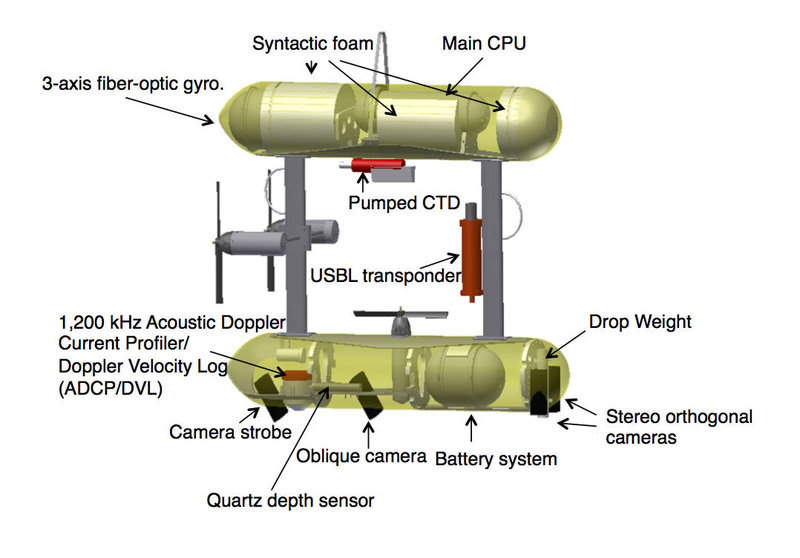

**AUVs** are self-contained submersibles. Their architecture includes a pressure hull (often with syntactic foam for buoyancy), thrusters for motion, and internal electronics (CPU, batteries) sealed inside. Navigation sensors (gyro/IMU, pressure/depth sensor, Doppler Velocity Log, sonar, cameras) and payloads (e.g. samplers) are integrated into the hull. The figure below (SeaBED AUV) labels typical subsystems.

  
*Figure: SeaBED AUV showing internal components like CPU, Doppler log, and cameras.*

**ROVs** consist of a *surface system* and the *subsea vehicle*, connected by a tether (umbilical). The surface system includes the topside control console, computers, and power supply. The tether carries electrical power and data (and sometimes fiber optics) down to the ROV. The ROV unit contains thrusters, cameras, lights, sensors, and any tools/manipulators, as well as its own onboard CPU.

  
*Figure: VideoRay Pro 3 ROV architecture with topside controller and tethered vehicle.*

Modern ROVs (e.g. VideoRay Pro 4) use a rugged PC on the surface and a high-speed digital bus.

  
*Figure: Pro 4 ROV architecture – surface PC and communication interface connect to underwater module.*