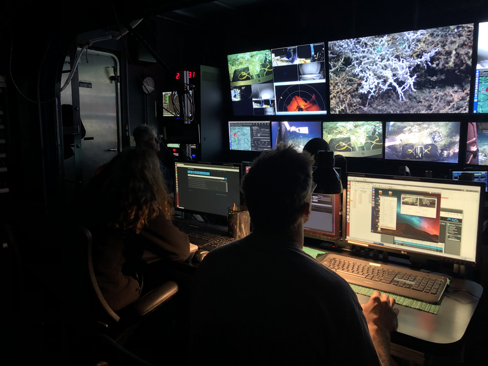

Underwater robots require dedicated support infrastructure. ROVs operate from a **surface control station** on a ship or platform. The control room contains pilots and data loggers working at consoles with multiple displays showing live video and sensor feeds.

  
*Figure: ROV control room with live video feeds and data streams.*

Key support components:

- **Tether and Power:** ROVs draw high-voltage power via tether. AUVs carry batteries.
- **Launch and Recovery:** Specialized winches, cranes, or LARS.
- **Communication:** ROVs use fiber-optic tethers. AUVs use low-band acoustic modems.