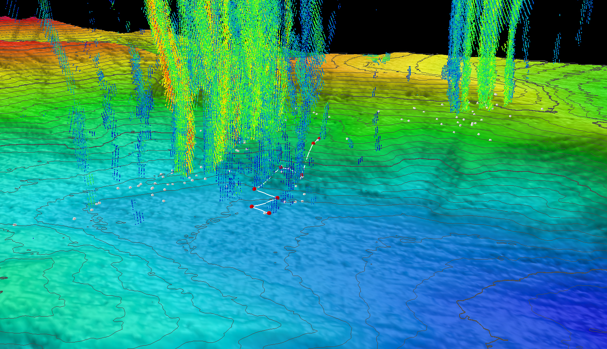

Missions are pre-planned with waypoints and tracks through the seafloor. For example:

  
*Figure: Planned dive track (white) and waypoints (red) over bathymetry.*

**Path Planning:**

- Algorithms like A*, Dijkstra, or hybrid approaches (e.g., A* + genetic) optimize 3D paths.
- Considerations: obstacle avoidance, current flow, energy usage.

**Navigation Sensors:**

- IMU, pressure sensor, compass, Doppler Velocity Log (DVL), sonar.
- Dead-reckoning used underwater; acoustic fixes or surfacing for position reset.

**Real-world Example:**

- Bluefin-21 AUV searched for Flight MH370 using a grid pattern and pre-loaded navigation mission.