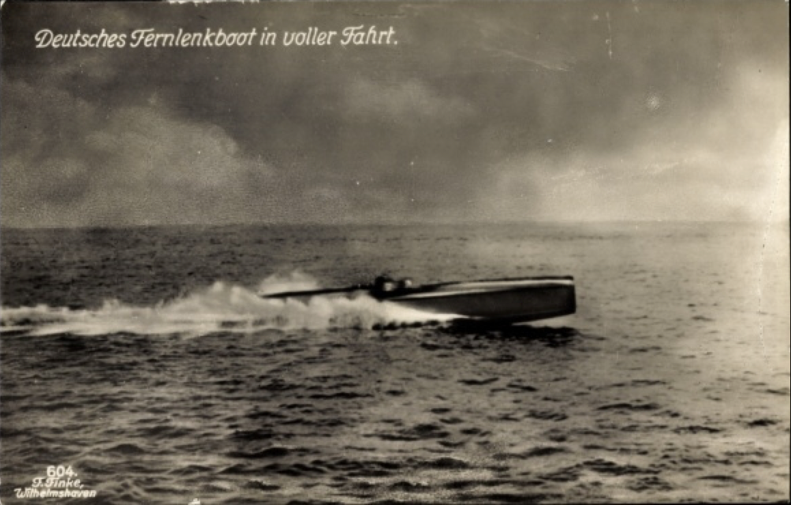
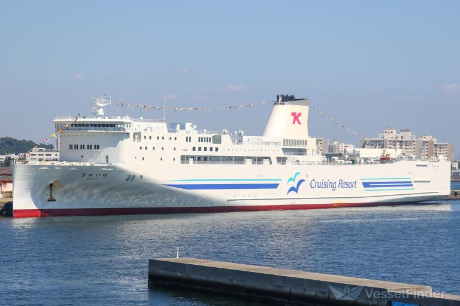

Introduction (UR): History, current trends, manned vs unmanned.
Locomotions (UR): Key design issues, attributes, basic theoretical model, payload.

Unmanned Surface Vehicle (USV)
Remotely Operated Vehicle (ROV)
Autonomous Underwater Vehicle (AUV)
Gliders
Crawlers
Biomimetic Underwater Robots

explain the history, current trends, manned vs unmanned for Unmanned Surface Vehicle (USV). Then, explain the key design issues, attributes, basic theoretical model, payload.

# Unmanned Surface Vehicle (USV)
Unmanned surface vehicle is a boat or ship that is either remotely controlled or fully autonomous.
## History

On 1917, The Fernlenkboot was one of the earliest documented unmanned surface vessels (USVs), developed by Germany during World War I. It was a 17m remote-controlled boat capable of carrying up to 200kg of explosives.

Unlike modern USVs that use radio signals or autonomous navigation systems, the Fernlenkboot was controlled via a 20-kilometer-long wire. This wired control system allowed operators to guide the boat toward its target.

The Fernlenkboot represents one of the earliest known examples of an unmanned surface vessel used in military applications.

On January 17, 2022, Soleil ferry built by Mitsubishi Shipbuilding Company and the Shin Nihonkai Ferry Company sail autonomously for 240km. This 222m ferry capable of docking and disembark autonomously.
## Current Trends
USVs are being equipped with enhanced autonomous navigation systems that allow them to operate independently in complex maritime environments. This includes advanced GPS, mapping technologies, and obstacle avoidance mechanisms, which improve their operational efficiency and safety.

The incorporation of a wide array of sensors (such as sonar, LiDAR, environmental sensors, and cameras) enables USVs to collect extensive data for various applications, including environmental monitoring, marine research, and security.
# References
- https://www.standingwellback.com/german-explosive-remote-control-speedboats-of-ww1-and-ww2/
- https://newatlas.com/marine/smart-coastal-autonomous-ferry/
- Kale, S. (2023). Developments in Unmanned Surface Vehicles (USVs): A Review. International Conference on Applied Engineering and Natural Sciences. https://doi.org/10.59287/icaens.1064.